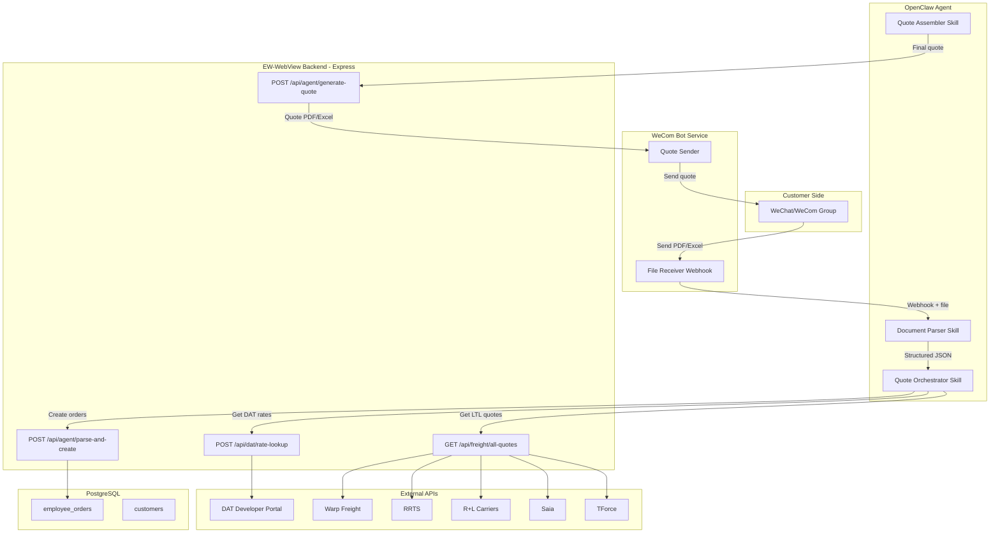

# AI Agent 自动报价系统技术设计

## 当前手工流程 vs 自动化流程

```
手工流程:
客户微信发文件 -> 报价员手动打开 -> 人工提取信息 -> 登录DAT查费率 -> 手动输入系统 -> 生成报价单 -> 微信回复客户

自动化流程:
客户企微发文件 -> WeCom Webhook -> OpenClaw Agent -> LLM解析文件 -> 调EW-WebView API -> DAT+承运商报价 -> 自动生成报价单 -> 企微回复客户
```

## 系统架构




## Phase 1: 企业微信(WeCom) Bot 接入

**为什么选 WeCom**: 个人微信没有官方 API，Wechaty 等逆向方案存在封号风险。WeCom 有官方 Webhook + 回调机制，稳定可靠。你已表示可以迁移。

**实现方式**:

- 在 WeCom 管理后台创建"自建应用"
- 配置"接收消息"回调 URL 指向你的服务器
- 当客户在群里发送文件(PDF/Excel)时，WeCom 会推送事件到回调 URL
- 回调服务下载文件，转发给 OpenClaw

**新增组件**: `backend/src/routes/wecom.js`

- `POST /api/wecom/callback` - 接收 WeCom 消息回调
- 验证签名(AES加密)
- 下载附件文件
- 通过 Webhook 触发 OpenClaw Agent

**关键 WeCom API**:

- 获取 access_token: `POST https://qyapi.weixin.qq.com/cgi-bin/gettoken`
- 下载媒体文件: `GET https://qyapi.weixin.qq.com/cgi-bin/media/get`
- 发送群消息: `POST https://qyapi.weixin.qq.com/cgi-bin/message/send`
- 发送群机器人消息: `POST https://qyapi.weixin.qq.com/cgi-bin/webhook/send`

---

## Phase 2: OpenClaw 文件解析 Skill

**核心思路**: 利用 OpenClaw 的 LLM 能力智能解析不同格式的客户需求单。

**OpenClaw Skill 设计 -- `parse_shipment_file`**:

```python
# OpenClaw Custom Skill: parse_shipment_file
# 功能: 解析客户发来的 Excel/PDF 文件，提取结构化运输数据

def parse_shipment_file(file_path: str) -> list[dict]:
    """
    输入: 客户上传的 Excel 或 PDF 文件路径
    输出: 结构化的货物列表 JSON
    
    每条记录包含:
    - tracking_number: 外箱单号
    - packaging_type: 包装类型
    - product_name_cn: 中文品名
    - product_name_en: 英文品名
    - cargo_value: 货值(美金)
    - destination_country: 目的国
    - destination_zip: 邮编
    - destination_city: 城市
    - company_name: 公司名
    - recipient_name: 收件人
    - phone: 电话
    - email: 邮箱
    - address: 详细地址
    - address_type: 地址类型(商业/住宅)
    - total_pieces: 总箱数
    - dimensions: [{length, width, height, pieces, weight, volume}]
    - delivery_method: 派送方式
    - notes: 备注
    """
```

**解析策略(两层保障)**:

1. **结构化解析**: 先用 `openpyxl`(Excel) 或 `pdfplumber`(PDF) 提取原始数据
2. **LLM 智能映射**: 将提取的原始数据发给 LLM，让它映射到标准字段结构
  - 处理不同客户的不同列名/格式
  - 处理合并单元格(如你的样本中多箱货物共用一行基本信息)
  - 处理缺失字段和异常值

**关键**: 从 Excel 样本来看，一个货物可能跨多行(如 GXUS162596 有4行尺寸数据)。LLM 需要理解这种"主行+子行"的结构。

---

## Phase 3: DAT API 集成

**现状**: 你们目前手动在 DAT 网页端查费率，数据库中有 `total_dat`, `dat_sales_1/2/3` 字段但手动填写。

**推荐方案**: 申请 DAT Developer Portal API 访问权限

- 注册: [https://developer.dat.com](https://developer.dat.com)
- 联系: [developersupport@dat.com](mailto:developersupport@dat.com)
- 需要: DAT iQ RateView 订阅 + Connexion 许可证

**新增后端路由**: `backend/src/routes/dat.js`

```javascript
// POST /api/dat/rate-lookup
// 输入: origin_zip, destination_zip, equipment_type, weight
// 输出: { spot_rate, contract_rate, low, high, average, per_mile }
```

**备选方案(如果API申请等待时间长)**:

- OpenClaw 的浏览器自动化功能登录 DAT 网页版查询费率
- 半自动模式: Agent 准备好所有数据，人工只需在 DAT 确认费率后录入

**与现有字段映射**:

- DAT API 返回的 spot rate -> `total_dat`
- DAT 不同价格区间 -> `dat_sales_1`, `dat_sales_2`, `dat_sales_3`

---

## Phase 4: 报价编排与计算

**OpenClaw Skill -- `orchestrate_quote`**:

对每一条解析出的货物记录:

1. **确定 Origin**: 从文件中提取发货地(如果有)，否则根据客户/仓库映射表确定
2. **调用 DAT API**: 获取 lane rate (origin_zip -> destination_zip)
3. **调用现有 LTL 承运商 API**: 复用 `freightApi.getAllLTLQuotes()` 中的 Warp, RRTS, RLC, Saia, TForce, EDI Express, STG
4. **计算最终报价**: 基于 DAT rate + carrier quotes + 利润率
5. **创建 employee_order**: 调用 EW-WebView API 写入数据库

**新增后端 API**: `backend/src/routes/agent.js`

```javascript
// POST /api/agent/batch-create-orders
// 输入: [{parsed shipment data + quotes}]
// 输出: [{order_id, order_number, ew_quote_number}]
// 功能: 批量创建 employee_orders 记录

// POST /api/agent/generate-quote-doc  
// 输入: [order_ids]
// 输出: Excel/PDF 报价单文件
// 功能: 复用 QuoteGenerator 逻辑生成报价文件
```

**利润计算逻辑(需要与业务确认)**:

- `ew_quote_price` = DAT rate * markup_factor + accessorial_fees
- `profit` = `ew_final_price` - `driver_payment`

---

## Phase 5: 报价分发与回复

**OpenClaw Skill -- `distribute_quotes`**:

1. 生成报价单文件(Excel/PDF)，复用现有 `QuoteGenerator.js` 的逻辑
2. 通过 WeCom API 将报价单发回客户微信群
3. 同时在 EW-WebView 系统内更新订单状态

**消息格式示例**:

```
[EW自动报价] 您好，以下是本次报价结果:

📦 GXUS162596 - 包装机 -> EL PASO, TX 79907
   报价: $XXX (商业地址)
   
📦 GXUS144320 - 粗碎机 -> SALEM, NY 12865  
   报价: $XXX (住宅地址)

详细报价单请查看附件。
如有疑问请回复此群。
```

---

## Phase 6: 人工审核与异常处理

**完全自动化有风险，建议加入人工审核环节**:

1. **置信度阈值**: 解析置信度 < 90% 的字段标记为需人工确认
2. **审核看板**: 在 EW-WebView 前端新增 "AI报价审核" 页面
  - 显示 AI 解析结果 vs 原始文件对比
  - 一键确认或手动修改
  - 确认后自动发送报价
3. **异常告警**: 解析失败、API 调用失败时通知管理员

---

## 新增文件清单


| 文件                                     | 说明                                                        |
| -------------------------------------- | --------------------------------------------------------- |
| `backend/src/routes/wecom.js`          | WeCom 回调接收 + 消息发送                                         |
| `backend/src/routes/dat.js`            | DAT API 费率查询                                              |
| `backend/src/routes/agent.js`          | AI Agent 专用 API (批量建单、生成报价)                               |
| `backend/src/services/wecomService.js` | WeCom API 封装                                              |
| `backend/src/services/datService.js`   | DAT API 封装                                                |
| `backend/src/services/agentService.js` | Agent 业务逻辑                                                |
| `frontend/src/pages/AIQuoteReview.js`  | AI 报价审核页面                                                 |
| OpenClaw Skills (3个)                   | parse_shipment_file, orchestrate_quote, distribute_quotes |


---

## 前置准备工作

1. **申请 DAT Developer Portal API** -- 这是最关键的依赖，需要时间审批
2. **注册企业微信** -- 创建企业 + 自建应用 + 配置回调
3. **确认 OpenClaw 部署环境** -- 确保可以安装自定义 Skills 和配置 Webhook
4. **确定定价规则** -- AI Agent 需要明确的利润计算公式

## 建议开发顺序

Phase 2 (文件解析) 和 Phase 3 (DAT API) 可以并行开发，不互相依赖。Phase 1 (WeCom 接入) 可以先用手动上传文件到 EW-WebView 的方式替代测试。Phase 4-6 依赖前三个 Phase 完成后串接。